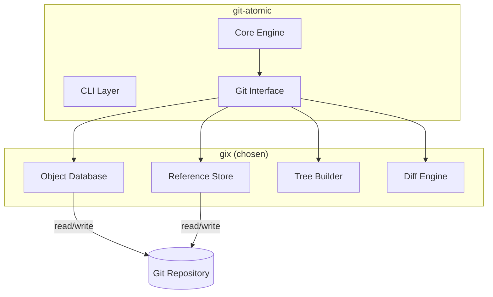

# ADR-002: Use gix for git operations

## Status

Accepted

## Date

2025-01-29

## Deciders

- Adam (project lead)

## Context and Problem Statement

git-atomic needs to perform git operations: reading commits, diffing trees, creating branches, building trees, and writing commit objects. The Rust ecosystem offers several options for git interaction, each with different trade-offs around native dependencies, API completeness, and maintenance.

The tool must work on Linux (primary), macOS, and Windows (best-effort). Build simplicity matters — minimizing native library dependencies reduces CI complexity and cross-compilation friction.

## Decision Drivers

- No native dependencies (simplifies cross-compilation and CI)
- API coverage for tree manipulation (critical for partial file application)
- Active maintenance and community
- Pure Rust (aligns with project values)
- Performance for tree-level operations

## Considered Options

### Option 1: gix (gitoxide)

Pure Rust git implementation. Provides low-level access to git objects, trees, and references without requiring libgit2.

| Pros | Cons |
|------|------|
| Pure Rust — no native deps | Younger project, API still evolving |
| Direct tree builder API | Some operations less documented |
| Fast object-level operations | Larger API surface to learn |
| Active development by Byron Batt | |
| No libgit2/OpenSSL build deps | |

### Option 2: git2-rs (libgit2 bindings)

Rust bindings to libgit2. Mature, widely used in the Rust ecosystem.

| Pros | Cons |
|------|------|
| Mature, battle-tested | Requires libgit2 native dependency |
| Well-documented API | Cross-compilation requires C toolchain |
| Large community | Maintenance tied to libgit2 upstream |
| | OpenSSL dependency on some platforms |

### Option 3: Shell out to git CLI

Invoke `git` commands via `std::process::Command`.

| Pros | Cons |
|------|------|
| Uses whatever git is installed | Requires git in PATH |
| Full feature coverage | Parsing text output is fragile |
| No library dependency | Performance overhead per operation |
| | Error handling is string-based |
| | No structured access to objects |

## Decision Outcome

Chose **Option 1: gix** because it provides pure Rust git operations without native dependencies, which simplifies builds and cross-compilation. Its tree builder API is critical for Phase 2's partial file application (building new trees with only component-specific files). The local-first architecture (ADR-001) means we need fast, in-process git operations rather than CLI round-trips.

### Confirmation

- `cargo build` succeeds without any system library dependencies
- Tree builder API supports creating partial trees for atomic branches
- Cross-compilation to Linux/macOS works without special toolchain setup

## Diagram

## Consequences

### Positive

- Zero native dependencies — `cargo build` just works
- Direct tree manipulation without worktree checkout (faster, no filesystem side effects)
- Pure Rust — consistent behavior across platforms
- No OpenSSL/libgit2 build issues in CI

### Negative

- gix API is still evolving — may require updates on minor version bumps
- Less community documentation compared to git2-rs
- Some advanced git features may not yet be implemented

### Neutral

- git2-rs could be added later as a fallback if gix lacks specific functionality
- The git interface module abstracts the implementation, making a swap feasible

## References

- [gix documentation](https://docs.rs/gix)
- [gitoxide project](https://github.com/GitoxideLabs/gitoxide)
- [Requirements: Section 10.1](../../.claude/plans/mvp/reference/requirements.md#101-confirmed-from-original-design)
