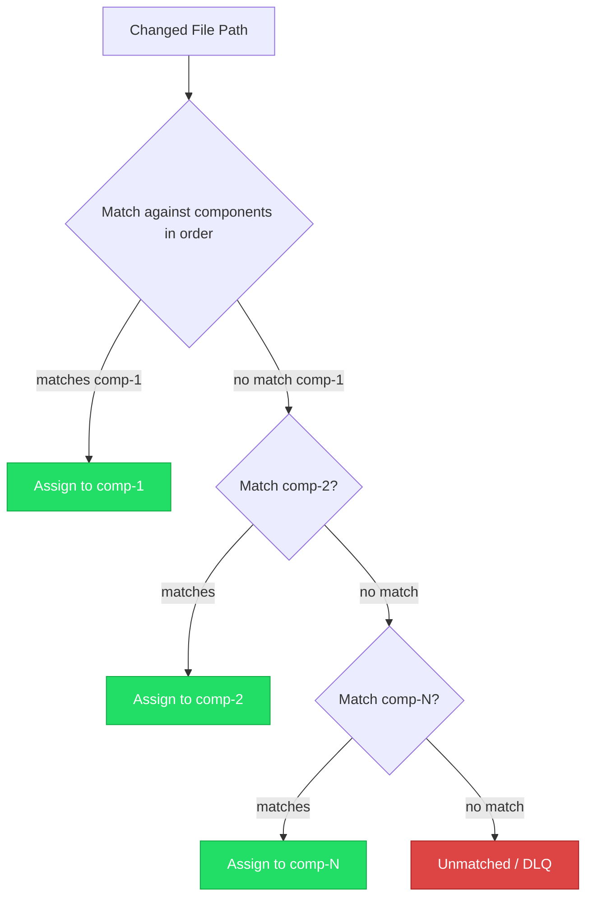

# ADR-003: Use globset with first-match-wins for component matching

## Status

Accepted

## Date

2025-01-29

## Deciders

- Adam (project lead)

## Context and Problem Statement

git-atomic maps changed files to components using glob patterns defined in `.atomic.toml`. Two decisions are coupled here:

1. **Which glob library** to use for pattern matching
2. **How to handle overlapping patterns** — when a file matches globs from multiple components

The glob matching is on the critical path for every atomization. It must be fast (NFR-001: < 2 seconds for single commit) and deterministic (same config always produces the same component assignment).

## Decision Drivers

- Performance — matching potentially hundreds of files against multiple pattern sets
- Determinism — identical input must produce identical output
- Simplicity — overlap resolution should be easy to understand and document
- User control — config authors should be able to reason about which component claims a file

## Considered Options

### Option 1: globset with first-match-wins

Use the `globset` crate (from the ripgrep ecosystem). Compile all patterns into a set. When a file matches multiple components, the first component in config order wins.

| Pros | Cons |
|------|------|
| Fast — compiled pattern sets, optimized matching | Config order becomes semantically significant |
| Deterministic — config order is stable | Users must understand ordering matters |
| Simple mental model — "first match wins" | Accidental shadowing possible |
| From ripgrep ecosystem — well-maintained | |

### Option 2: glob crate with error on overlap

Use the `glob` crate. Match files one-by-one. If a file matches multiple components, return an error.

| Pros | Cons |
|------|------|
| No ambiguity — overlaps are explicit errors | Slower — patterns not compiled |
| Forces clean config | Inconvenient for catch-all patterns |
| Simple implementation | `_other` catch-all component becomes impossible |
| | Users must manually ensure no overlap |

### Option 3: ignore crate

Use the `ignore` crate (also from ripgrep). Provides gitignore-style matching with precedence rules.

| Pros | Cons |
|------|------|
| Gitignore semantics are familiar | More complex than needed |
| Handles negation patterns | Designed for file walking, not categorization |
| Well-maintained | Overkill for component matching |

## Decision Outcome

Chose **Option 1: globset with first-match-wins** because it provides the best performance (compiled pattern sets), supports the `_other` catch-all pattern (which must be last), and has a simple mental model that users can reason about. Config order is already semantically meaningful in TOML (insertion order is preserved), so leveraging it for priority is natural.

### Confirmation

- Benchmark: matching 100 files against 10 component patterns completes in < 1ms
- `_other` catch-all component works when placed last in config
- Documentation clearly states "first match wins" with examples

## Diagram

## Consequences

### Positive

- Fast matching via compiled pattern sets
- Catch-all `_other` component is naturally supported (place last)
- Deterministic — same config always produces same assignment
- Well-maintained dependency from the ripgrep ecosystem

### Negative

- Config order matters — reordering components can change file assignment
- Accidental shadowing: a broad pattern early in config can swallow files meant for later components
- Users must understand "first match wins" to write correct configs

### Neutral

- The `validate` command (Phase 3) can detect potential overlap and warn users
- This is consistent with how `.gitignore` and similar tools handle precedence

## References

- [globset documentation](https://docs.rs/globset)
- [Requirements: FR-004](../../.claude/plans/mvp/reference/requirements.md#31-core-atomization) — Map files to components via glob patterns
- [Requirements: Section 5](../../.claude/plans/mvp/reference/requirements.md#5-configuration-schema)
