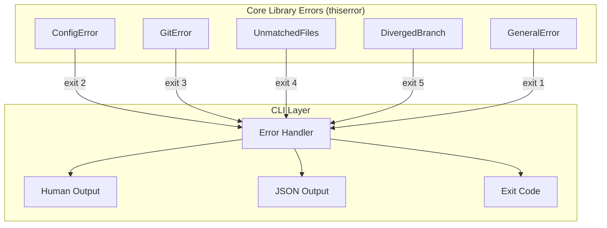

# ADR-004: Use thiserror for error hierarchy

## Status

Accepted

## Date

2025-01-29

## Deciders

- Adam (project lead)

## Context and Problem Statement

git-atomic defines specific exit codes for different error categories (configuration errors = 2, git operation failures = 3, unmatched files = 4, diverged branches = 5). The error handling approach must:

- Map cleanly to these exit codes
- Provide user-friendly messages with remediation hints (NFR-021)
- Support structured errors for JSON output mode
- Be ergonomic for library authors (derive macros preferred)

## Decision Drivers

- Clean mapping from error types to exit codes
- Derive-based ergonomics (minimal boilerplate)
- User-facing error messages with context
- Compatibility with structured (JSON) error output
- Ecosystem adoption and maintenance

## Considered Options

### Option 1: thiserror

Derive macro for `std::error::Error`. Generates `Display` and `From` implementations. Designed for library-style error types.

| Pros | Cons |
|------|------|
| Derive-based — minimal boilerplate | No built-in error context chain (use with `#[from]`) |
| Clean enum variants map to exit codes | No runtime error reporting (that's `eyre`/`anyhow`'s job) |
| Well-maintained (dtolnay) | |
| Composable with other error crates | |
| Zero runtime overhead | |

### Option 2: anyhow

Dynamic error type with context chaining. Designed for application-level error handling.

| Pros | Cons |
|------|------|
| Easy context chaining (`.context()`) | Dynamic errors — no typed variants for exit codes |
| Good for quick prototyping | Harder to match on specific error types |
| Backtrace support | Not suitable for library-style enums |
| | JSON serialization requires custom work |

### Option 3: miette

Rich diagnostic error reporting with source spans, labels, and help text.

| Pros | Cons |
|------|------|
| Beautiful terminal error output | Heavier dependency |
| Built-in help text and suggestions | Overkill for non-compiler tools |
| Source code spans | More complex to implement |
| | Less common in CLI tools |

## Decision Outcome

Chose **Option 1: thiserror** because its derive-based enum approach maps directly to git-atomic's exit code model. Each error variant corresponds to an exit code, and the `Display` derive provides user-facing messages. For the application boundary (CLI layer), thiserror errors are caught and mapped to exit codes and optional JSON error output. This separation keeps core logic clean while supporting both human and machine-readable error output.

### Confirmation

- Each exit code (1-5) has a corresponding error enum variant
- `--json` mode serializes errors with code, message, and hint fields
- Error messages include actionable remediation hints

## Diagram

## Consequences

### Positive

- Zero-cost abstractions — no runtime overhead for error types
- Typed error variants enable exhaustive matching at the CLI boundary
- Exit codes are a natural mapping from enum variants
- Composable — can wrap gix errors, config errors, IO errors via `#[from]`

### Negative

- No built-in context chaining — must manually add context where needed
- Error messages are static (from `#[error("...")]`) — dynamic context requires format args
- Adding a new exit code means adding a new variant and updating the mapping

### Neutral

- `anyhow` could wrap thiserror types at the application boundary if richer context is needed later
- `miette` could be added for enhanced terminal output without changing the error type hierarchy

## References

- [thiserror documentation](https://docs.rs/thiserror)
- [Requirements: Section 7](../../.claude/plans/mvp/reference/requirements.md#7-exit-codes) — Exit codes
- [Requirements: NFR-021](../../.claude/plans/mvp/reference/requirements.md#43-reliability) — Clear error messages with remediation hints
