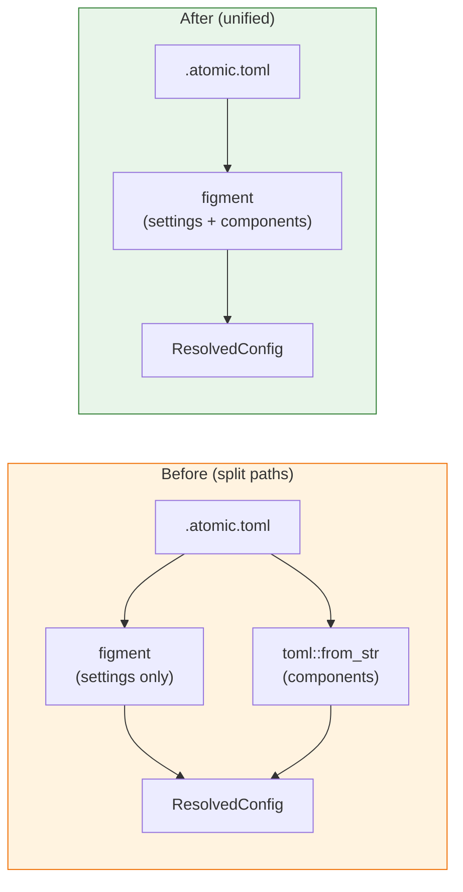

# ADR-007: Use TOML array of tables for component definitions

## Status

Accepted

## Date

2026-01-29

## Deciders

- Adam (project lead)

## Context and Problem Statement

git-atomic's configuration uses `[components.<name>]` sections in `.atomic.toml`, which deserializes into `IndexMap<String, Component>`. The `IndexMap` preserves insertion order, which is critical for first-match-wins glob matching (ADR-003).

However, this `IndexMap`-based format creates a split in the config loading architecture. figment's TOML provider doesn't guarantee `IndexMap` insertion order, so components must be loaded via `toml::from_str()` directly while settings use figment for layered merging (ADR-006). This means two separate config loading paths for a single file.

TOML provides an alternative: **arrays of tables** (`[[components]]`), which are guaranteed by the TOML specification to preserve document order. This would allow figment to own the entire configuration — settings and components — through a single provider chain.

## Decision Drivers

- Unify config loading under figment (eliminate split loading paths)
- Preserve first-match-wins ordering guarantee (ADR-003)
- Pre-1.0 — breaking changes to config format are acceptable
- Simplicity of implementation and maintenance

## Considered Options

### Option 1: Keep `IndexMap`-based format (status quo)

```toml
[components.frontend]
globs = ["src/ui/**"]

[components.backend]
globs = ["src/api/**"]
```

| Pros | Cons |
|------|------|
| No breaking change | figment can't guarantee insertion order |
| Component name is the TOML key — implicit dedup | Requires split loading paths (figment for settings, toml for components) |
| Familiar map-of-maps pattern | Two config engines for one file |

### Option 2: TOML array of tables (chosen)

```toml
[[components]]
name = "frontend"
globs = ["src/ui/**"]

[[components]]
name = "backend"
globs = ["src/api/**"]
```

| Pros | Cons |
|------|------|
| TOML spec guarantees document order | Breaking change to `.atomic.toml` format |
| figment can load entire config (no split paths) | Must validate name uniqueness manually |
| `name` is an explicit field — clearer schema | Slightly more verbose |
| `Vec<Component>` makes ordering explicit in the type system | |
| Standard pattern for ordered collections in TOML | |

### Option 3: Separate components file

Move components to a separate `components.toml` loaded independently.

| Pros | Cons |
|------|------|
| Clean separation | Two config files to manage |
| Each file uses its optimal loader | Increases user cognitive load |
| No format change needed | Overcomplicates simple setups |

## Decision Outcome

Chose **Option 2: TOML array of tables**. The format change allows figment to own the entire configuration through a single provider chain, eliminating the split loading paths. TOML arrays of tables guarantee document order by spec, preserving first-match-wins semantics (ADR-003). Since git-atomic is pre-1.0, a breaking config format change is acceptable.

### Implementation

The `Config` type changes from:

```rust
// Before
pub struct Config {
    pub settings: Settings,
    pub components: IndexMap<String, Component>,
}

pub struct Component {
    pub globs: Vec<String>,
    pub commit_type: Option<String>,
    pub branch: Option<String>,
}
```

To:

```rust
// After
pub struct Config {
    pub settings: Settings,
    pub components: Vec<Component>,
}

pub struct Component {
    pub name: String,
    pub globs: Vec<String>,
    pub commit_type: Option<String>,
    pub branch: Option<String>,
}
```

Validation must check:
- Component names are unique (previously enforced by TOML map keys)
- At least one component is defined (for commands that require components)

## Diagram



## Consequences

### Positive

- Single config loading path — figment handles everything
- Document-order guarantee comes from TOML spec, not `IndexMap` implementation detail
- `Vec<Component>` makes ordering explicit in Rust's type system
- `name` field is visible in the config file — clearer than implicit map key
- Simpler `load_layered_config()` — no separate component loading branch

### Negative

- Breaking change to `.atomic.toml` format (acceptable pre-1.0)
- Must validate component name uniqueness manually (was free with map keys)
- Slightly more verbose config (`name = "frontend"` on each component)
- Existing configs need migration (provide clear error message pointing to new format)

### Neutral

- `init` command generates the new format automatically
- `validate` command checks name uniqueness as part of its checks
- Other tools reading `.atomic.toml` must update their parsers

## References

- [ADR-003: Use globset with first-match-wins](./adr-003-use-globset-with-first-match-wins.md) — ordering guarantee preserved
- [ADR-006: Layered configuration with git config](./adr-006-layered-config-with-git-config.md) — figment adoption for layering
- [TOML spec: Array of Tables](https://toml.io/en/v1.0.0#array-of-tables) — document-order guarantee
